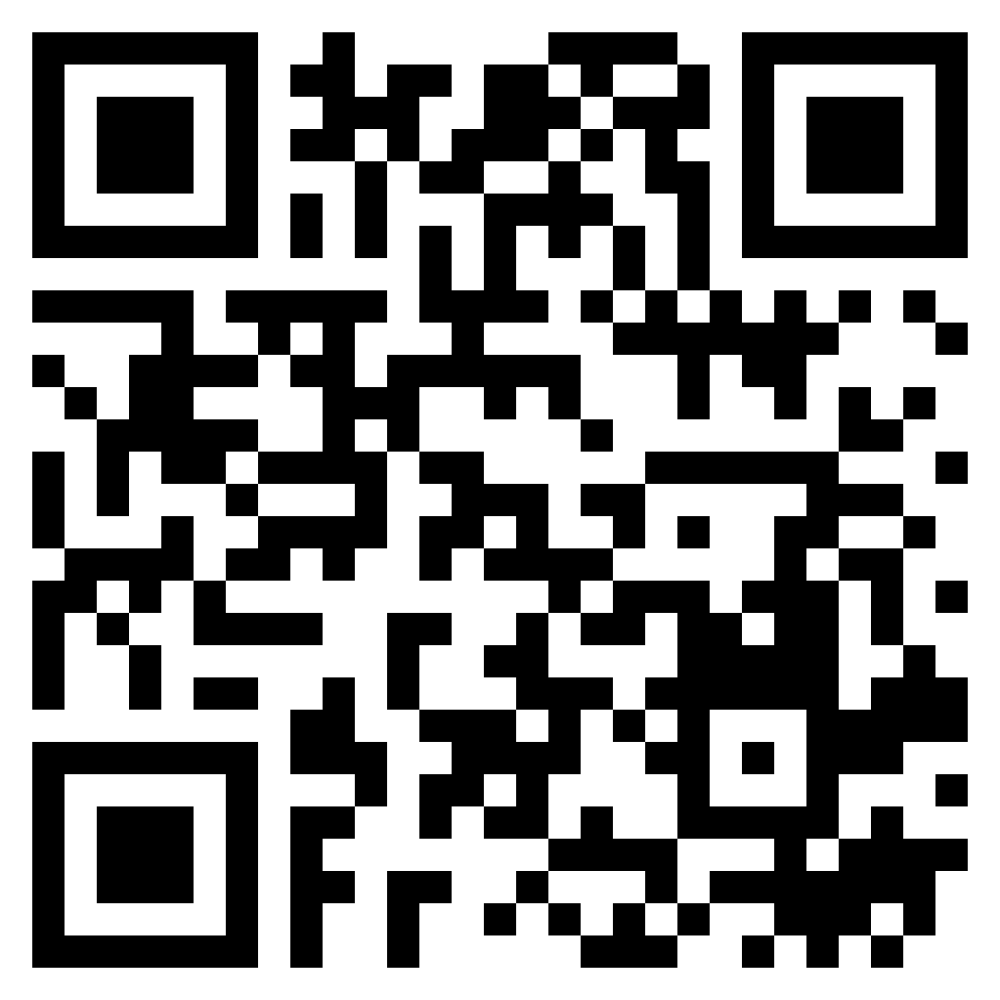

# Automerge example

This is a to-do app written by @scriptcoded to demo Automerge at @Knowitcore.

The app demonstrates how Automerge manages to successfully merge changes done in
different offline sessions when they go online again. The app only covers the
data structure and as such doesn't include any service worker to cache it and
make it available offline. The offline capabilities can still be tested by
loading the app while online and then going offline as the assets are already
loaded by then.

The app includes some sneaky code in `index.html` to redirect `#demo` to a
hard-coded Automerge document. This makes testing out and demoing a lot easier.
If you don't supply the `#demo` hash the latest used automerge document stored
in the browser will be used. If there is none a new will be created. Since this
demo app is connected to the public Automerge WSS sync server you can share this
URL with anyone and they'll also get a copy of the document.

The live instance can be accessed at https://automerge-demo.vercel.app/#demo or by scanning this QR code:

   

## How does it work?

I'll keep this short. If you want to learn more check out the [Automerge documentation](https://automerge.org/).

Automerge is a is organized around "documents". A document can be thought of as
a JavaScript Object that instead of just storing its key-value pairs tracks any
changes made to it and stores those instead. Documents are portable and can be
shared with multiple users and even if changes to different copies of this one
document are made in different places at different times Automerge can
automagically merge these two copies into one. This is the magic that Automerge
provides. Data types that work like this are called *Conflict-free Replicated
Data Types* or CRDTs. If you want to learn more about them you can read up on
[crdt.tech](http://crdt.tech/).

Documents can contain other documents which allows us to create rather complex
structures if need be. If we were to build a collaborative text editing app we
could have every user have their own personal "root" document. This document
could then contain multiple other documents each corresponding to a text file.
If a user wanted to share a text file with another user they could simply send
the corresponding document to that other user and they would both have the
document in their "root" documents.

For this app we have a similiar structure, but instead we have one root document
which contains multiple to-do items, each being its own document. And to keep
things simple we share just the root document with all todos contained.

## Tech

This is a simple Vite app with React. Tailwind CSS is for styling, Iconoir for
icons and of course Automerge for the data. Finally there are some small utility
libraries for quick prototyping.

## References

Relevant to this demo:
- Automerge: https://automerge.org/
- CRDTs: https://crdt.tech/

Other interesting resources:
- Yjs: https://yjs.dev/
- Tiptap (headless WYSIWYG editor that works nicely with Automerge text): https://tiptap.dev/docs/editor/guide/collaborative-editing
